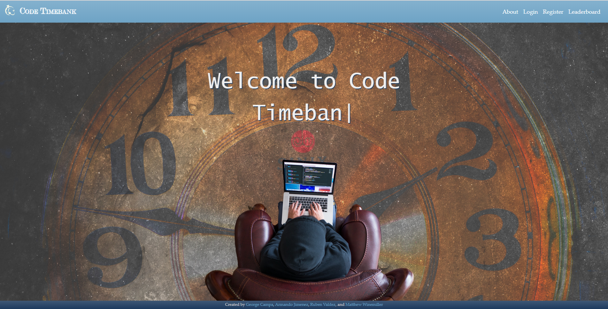
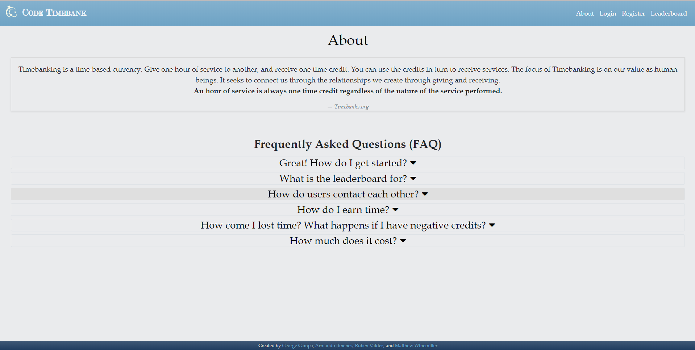
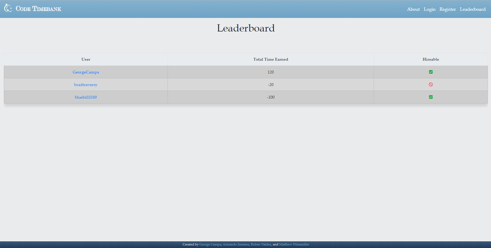
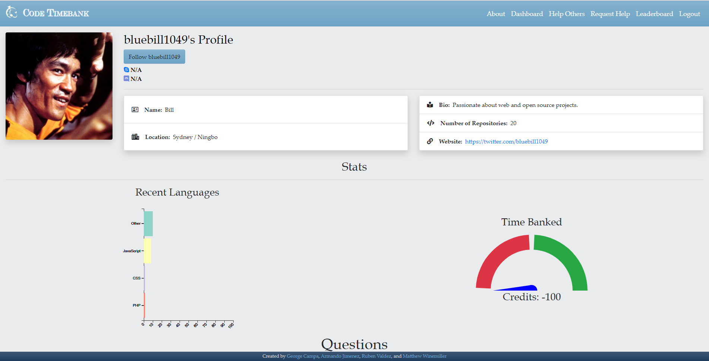
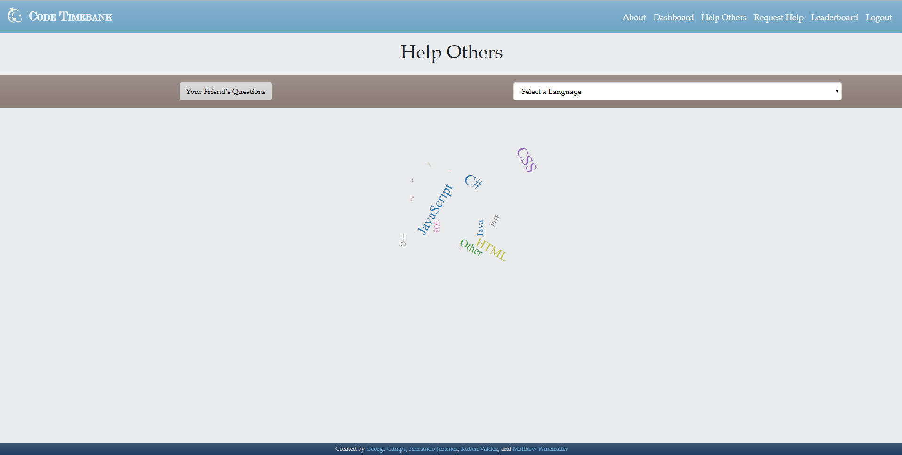
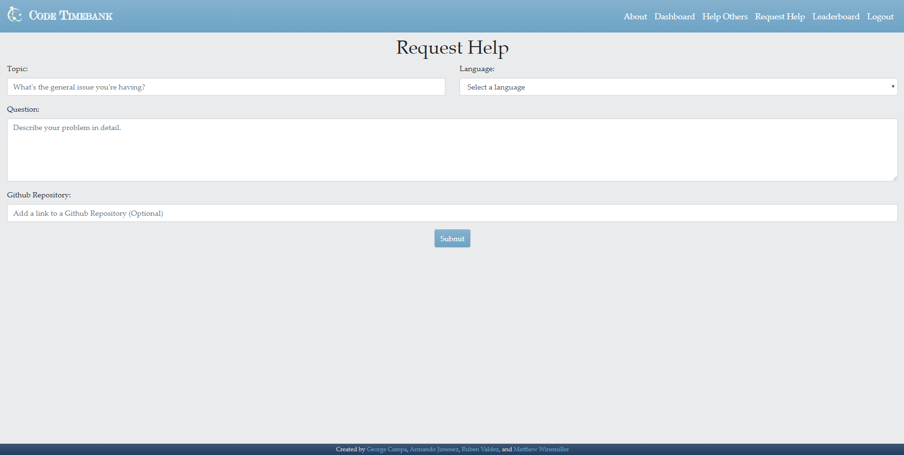

# CodeTimebank

### Heroku Link: https://code-timebank.herokuapp.com/

### Description: Code Timebank
Code Timebank is a website designed for learning programming languages socially. Users seeking help post questions, and other users may help resolve issues. Communication takes place on Skype or Discord. Once problems are solved, users reward those that help with “credits” depending on how much time was spent in assistance. One credit is one hour. They are earned when assisting others, and lost when receiving help from others. A leaderboard ranks users by total credits earned, and displays their hireability.

# Index page

# About Page

# LeaderBoard Page

# Profile Page

# Help Other Page

# Request Help Page

